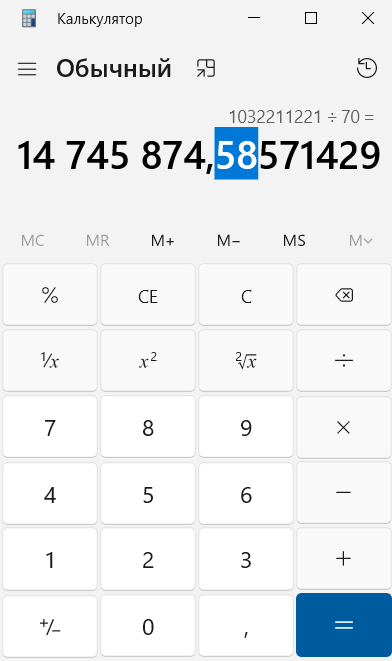

---
## Front matter
lang: ru-RU
title: "Презентация по лабораторной работе №2"
subtitle: "Задача о погоне"
author:
  - Махорин И.С.
institute:
  - Российский университет дружбы народов, Москва, Россия
date: 17 февраля 2024

## i18n babel
babel-lang: russian 
babel-otherlangs: english 
mainfont: Arial 
monofont: Courier New 
fontsize: 12pt

## Formatting pdf
toc: false
toc-title: Содержание
slide_level: 2
aspectratio: 169
section-titles: true
theme: metropolis
header-includes:
 - \metroset{progressbar=frametitle,sectionpage=progressbar,numbering=fraction}
 - '\makeatletter'
 - '\beamer@ignorenonframefalse'
 - '\makeatother'
---

# Цель работы

  Решить задачу о погоне и изучить основы языка программирования Julia.

# Задание

- Изучить основы языка программирования Julia.
- Решить задачу о погоне. 

# Расчет варианта для выполнения

{#fig:001 width=20%}

# Решение задачи 

$$ t = {{x }\over{v}} $$
$$ t = {{20,3-x}\over{5,2 v}} $$
$$ t = {{20,3+x}\over{5,2 v}} $$

## Решение задачи

Из этих уравнений получаем объедиение двух уравнений:

$$ \left[ \begin{array}{cl}
{{x}\over{v}} = {{20,3-x}\over{5,2 v}}\\
{{x}\over{v}} = {{20,3+x}\over{5,2 v}}
\end{array} \right. $$

## Решение задачи

Решая это, получаем два значения для x:
$$ x1 = {{3,27419355}} $$
$$ x2 = {{4,83333333}} $$

## Решение задачи

$$ v_\tau  $$ – тангенциальная скорость
$$ v $$ – радиальная скорость
$$ v = {dr\over dt} $$
$$ v_\tau = {{\sqrt{((5,2*v)^2-v^2)}}} = {\sqrt{651}*v \over{5}}   $$

## Решение задачи

$$ \left\{ \begin{array}{cl}
{dr\over dt} = v \\
r{d\theta\over dt} = {\sqrt{651}*v \over{5}} 
\end{array} \right. $$

## Решение случая №1

$$ \left\{ \begin{array}{cl}
\theta_0 = 0 \\
r_0 = x_1 = {{3,27419355}}
\end{array} \right. $$

или

## Решение случая №2

$$ \left\{ \begin{array}{cl}
\theta_0 = -\pi \\
r_0 = x_2 = {{4,83333333}}
\end{array} \right. $$

## Итоговое уравнение

$$ {dr\over d\theta} = {5r\over\sqrt{651}} $$

# Моделирование с помощью Julia

{#fig:002 width=70%}

## Запускаем Julia
 
{#fig:003 width=70%}

## Процесс запуска Julia

{#fig:004 width=70%}

## Скачаем необходимые для работы пакеты

{#fig:005 width=70%}

## Скачаем необходимые для работы пакеты

{#fig:006 width=70%}

## Запуск кода

{#fig:007 width=70%}

## Просмотр результата работы.Случай 1

{#fig:008 width=70%}

## Просмотр результата работы.Случай 2

{#fig:009 width=70%}

# Вывод

Были изучены основы языка программирования Julia и его библиотеки, которые используются для построения графиков и решения дифференциальных уравнений. А также решили задачу о погоне.
