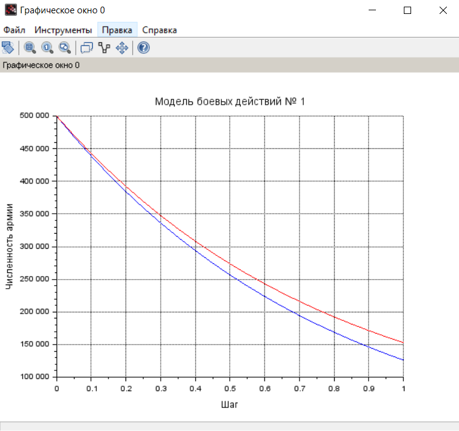
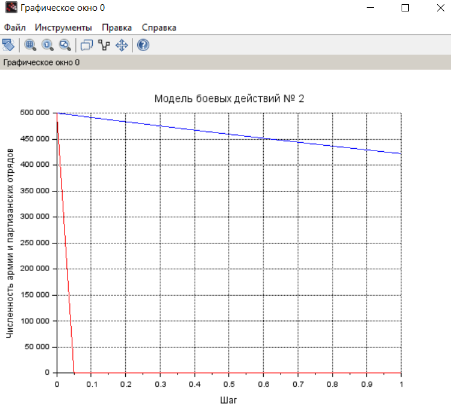

---
## Front matter
lang: ru-RU
title: Лабораторная работа №3
subtitle: Модель боевых действий
author:
  - Махорин И. С.
institute:
  - Российский университет дружбы народов, Москва, Россия
date: 21 февраля 2024

## i18n babel
babel-lang: russian
babel-otherlangs: english

## Formatting pdf
toc: false
toc-title: Содержание
slide_level: 2
aspectratio: 169
section-titles: true
theme: metropolis
header-includes:
 - \metroset{progressbar=frametitle,sectionpage=progressbar,numbering=fraction}
 - '\makeatletter'
 - '\beamer@ignorenonframefalse'
 - '\makeatother'
---

# Информация

## Докладчик

:::::::::::::: {.columns align=center}
::: {.column width="70%"}

  * Махорин Иван Сергеевич
  * Студент
  * Обучающийся на кафедре теории вероятностей и кибербезопасности
  * Российский университет дружбы народов
  * [ivan.mahorin@yandex.ru](mailto:ivan.mahorin@yandex.ru)
  * <https://github.com/Ivan-Mahorin>

:::
::::::::::::::

# Вводная часть

## Цели и задачи

- Построить графики модели боевых действий, а также ознакомиться с Scilab.

# Основная часть

## Задание

**Вариант 59**  
  Задача: Между страной Х и страной У идет война. Численность состава войск
исчисляется от начала войны, и являются временными функциями x(t) и y(t). В
начальный момент времени страна Х имеет армию численностью 500 000 человек,
а в распоряжении страны У армия численностью в 500 000 человек. Для упрощения
модели считаем, что коэффициенты a,b,c,h постоянны. Также считаем P(t) и Q(t) непрерывные функции.
  Постройте графики изменения численности войск армии Х и армии У для
следующих случаев: 

## Модель боевых действий между регулярными войсками

  $\frac{\partial x}{\partial t} = -0,45x(t)-0,86y(t)+sin(t+1)$  
  $\frac{\partial y}{\partial t} = -0,49x(t)-0,73y(t)+cos(t+2)$

## Модель ведение боевых действий с участием регулярных войск и партизанских отрядов 

  $\frac{\partial x}{\partial t} = -0,17x(t)-0,65y(t)+sin(2t)+2$  
  $\frac{\partial y}{\partial t} = -0,31x(t)y(t)-0,28y(t)+cos(t)+2$

## Подробное рассмотрение уравнений

1.1. Потери, не связанные с боевыми действиями, описывают члены -0,45x(t) и -0,73y(t), 
члены -0,86y(t) и -0,49x(t) отражают потери на поле боя. Функции P(t)=sin(t+1), Q(t)=cos(t+2) учитывают
возможность подхода подкрепления к войскам Х и У в течение одного дня. 

## Подробное рассмотрение уравнений

1.2. Потери, не связанные с боевыми действиями, описывают члены -0,17x(t) и -0,28y(t), 
члены -0,65y(t) и -0,31x(t)y(t) отражают потери на поле боя. Функции P(t)=sin(2t)+2, Q(t)=cos(t)+2 учитывают
возможность подхода подкрепления к войскам Х и У в течение одного дня. 

## Подробное рассмотрение уравнений

1.3. Начальные условия для обоих случаев будут равно $x_{0}=500000$, $y_{0}=500000$

## Построение графиков численности войск

{#fig:001 width=50%}

## Построение графиков численности войск

{#fig:002 width=50%}

## Выводы

- В результате выполнения лабораторной работы мы научились решать и строить графики модели боевых действий в среде Scilab.
