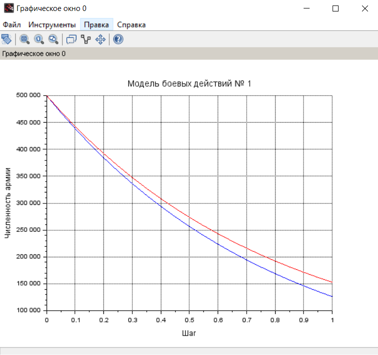
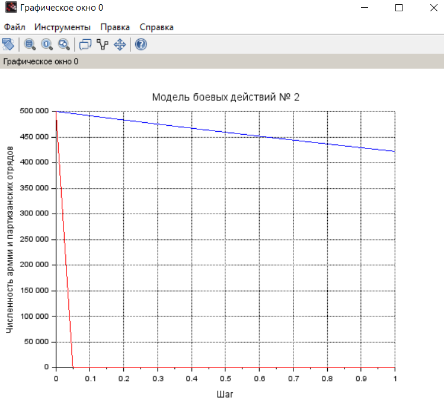

---
## Front matter
title: "Лабораторная работа №3"
subtitle: "Модель боевых действий"
author: "Махорин Иван Сергеевич"

## Generic otions
lang: ru-RU
toc-title: "Содержание"

## Bibliography
bibliography: bib/cite.bib
csl: pandoc/csl/gost-r-7-0-5-2008-numeric.csl

## Pdf output format
toc: true # Table of contents
toc-depth: 2
lof: true # List of figures
lot: true # List of tables
fontsize: 12pt
linestretch: 1.5
papersize: a4
documentclass: scrreprt
## I18n polyglossia
polyglossia-lang:
  name: russian
  options:
	- spelling=modern
	- babelshorthands=true
polyglossia-otherlangs:
  name: english
## I18n babel
babel-lang: russian
babel-otherlangs: english
## Fonts
mainfont: PT Serif
romanfont: PT Serif
sansfont: PT Sans
monofont: PT Mono
mainfontoptions: Ligatures=TeX
romanfontoptions: Ligatures=TeX
sansfontoptions: Ligatures=TeX,Scale=MatchLowercase
monofontoptions: Scale=MatchLowercase,Scale=0.9
## Biblatex
biblatex: true
biblio-style: "gost-numeric"
biblatexoptions:
  - parentracker=true
  - backend=biber
  - hyperref=auto
  - language=auto
  - autolang=other*
  - citestyle=gost-numeric
## Pandoc-crossref LaTeX customization
figureTitle: "Рис."
tableTitle: "Таблица"
listingTitle: "Листинг"
lofTitle: "Список иллюстраций"
lotTitle: "Список таблиц"
lolTitle: "Листинги"
## Misc options
indent: true
header-includes:
  - \usepackage{indentfirst}
  - \usepackage{float} # keep figures where there are in the text
  - \floatplacement{figure}{H} # keep figures where there are in the text
---

# Цель работы

Построить графики модели боевых действий, а также ознакомиться с Scilab.

# Задание

**Вариант 59**  
  Задача: Между страной Х и страной У идет война. Численность состава войск
исчисляется от начала войны, и являются временными функциями x(t) и y(t). В
начальный момент времени страна Х имеет армию численностью 500 000 человек,
а в распоряжении страны У армия численностью в 500 000 человек. Для упрощения
модели считаем, что коэффициенты a,b,c,h постоянны. 
постоянны. Также считаем P(t) и Q(t) непрерывные функции.
  Постройте графики изменения численности войск армии Х и армии У для
следующих случаев: 

1. Модель боевых действий между регулярными войсками  
  $\frac{\partial x}{\partial t} = -0,45x(t)-0,86y(t)+sin(t+1)$  
  $\frac{\partial y}{\partial t} = -0,49x(t)-0,73y(t)+cos(t+2)$

2. Модель ведение боевых действий с участием регулярных войск и
партизанских отрядов  
  $\frac{\partial x}{\partial t} = -0,17x(t)-0,65y(t)+sin(2t)+2$  
  $\frac{\partial y}{\partial t} = -0,31x(t)y(t)-0,28y(t)+cos(t)+2$

# Выполнение лабораторной работы

**1. Рассмотрим подробнее уравнения**

1.1. Потери, не связанные с боевыми действиями, описывают члены -0,45x(t) и -0,73y(t), 
члены -0,86y(t) и -0,49x(t) отражают потери на поле боя. Функции P(t)=sin(t+1), Q(t)=cos(t+2) учитывают
возможность подхода подкрепления к войскам Х и У в течение одного дня. 

1.2. Потери, не связанные с боевыми действиями, описывают члены -0,17x(t) и -0,28y(t), 
члены -0,65y(t) и -0,31x(t)y(t) отражают потери на поле боя. Функции P(t)=sin(2t)+2, Q(t)=cos(t)+2 учитывают
возможность подхода подкрепления к войскам Х и У в течение одного дня. 
  
1.3. Начальные условия для обоих случаев будут равно $x_{0}=500000$, $y_{0}=500000$

**2. Построение графиков численности войск**

2.1. Напишем первую программу для Scilab:
```
//начальные условия
x0 = 500000;//численность первой армии
y0 = 500000;//численность второй армии
t0 = 0;//начальный момент времени
a = 0.45;//константа, характеризующая степень влияния различных факторов на потери
b = 0.86;//эффективность боевых действий армии у
c = 0.49;//эффективность боевых действий армии х
h = 0.73;//константа, характеризующая степень влияния различных факторов на потери
tmax = 1;//предельный момент времени
dt = 0.05;//шаг изменения времени
t = [t0:dt:tmax];
function p = P(t)//возможность подхода подкрепления к армии х
p = sin(t+1);
endfunction
function q = Q(t)//возможность подхода подкрепления к армии у
q = cos(t+2);
endfunction
//Система дифференциальных уравнений
function dy = syst(t, y)
dy(1) = - a*y(1) - b*y(2) + P(t);//изменение численности первой армии
dy(2) = - c*y(1) - h*y(2) + Q(t);//изменение численности второй армии
endfunction
v0 = [x0;y0];//Вектор начальных условий
//Решение системы
y = ode(v0,t0,t,syst);
//Построение графиков решений
scf(0);
plot2d(t,y(1,:),style=2);//График изменения численности армии х(синий)
xtitle('Модель боевых действий № 1','Шаг','Численность армии');
plot2d(t,y(2,:), style = 5);//График изменения численности армии у (красный)
xgrid();

```
В результате выполнения кода мы получаем следующий график (рис. -@fig:001).

{#fig:001 width=100%}

2.2. Напишем вторую программу для Scilab:
```
x0 = 500000;
y0 = 500000;
t0 = 0;
a = 0.17;
b = 0.65;
c = 0.31;
h = 0.28;
tmax = 1;
dt = 0.05;
t = [t0:dt:tmax];
function p = P(t)
p = sin(2*t)+2;
endfunction
function q = Q(t)
q = cos(t)+2;
endfunction
//Система дифференциальных уравнений
function dy = syst(t, y)
dy(1) = - a*y(1) - b*y(2) + P(t);
dy(2) = - c*y(1)*y(2) - h*y(2) + Q(t);
endfunction
v0 = [x0;y0];
y = ode(v0,t0,t,syst);
scf(0);
plot2d(t,y(1,:),style=2);
xtitle('Модель боевых действий № 2','Шаг','Численность армии и парт. отрядов');
plot2d(t,y(2,:), style = 5);
xgrid();

```
В результате выполнения кода мы получаем следующий график (рис. -@fig:002).

{#fig:002 width=100%}

# Выводы

В результате выполнения лабораторной работы мы научились решать и строить графики модели боевых действий в среде Scilab.