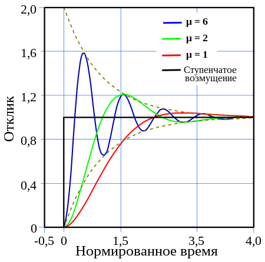
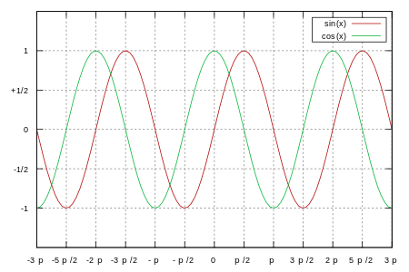
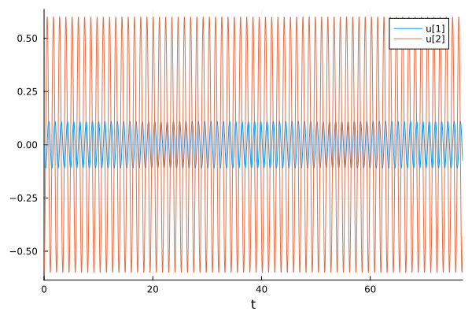
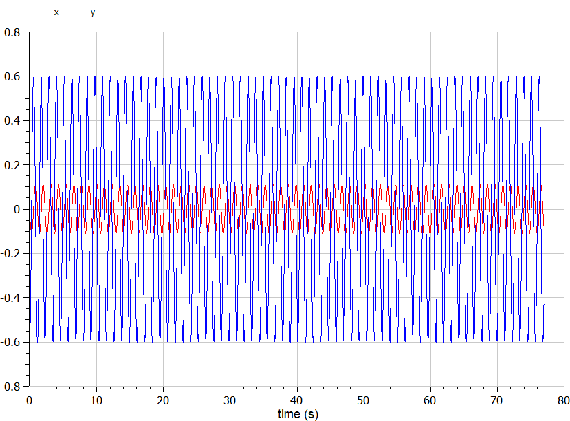
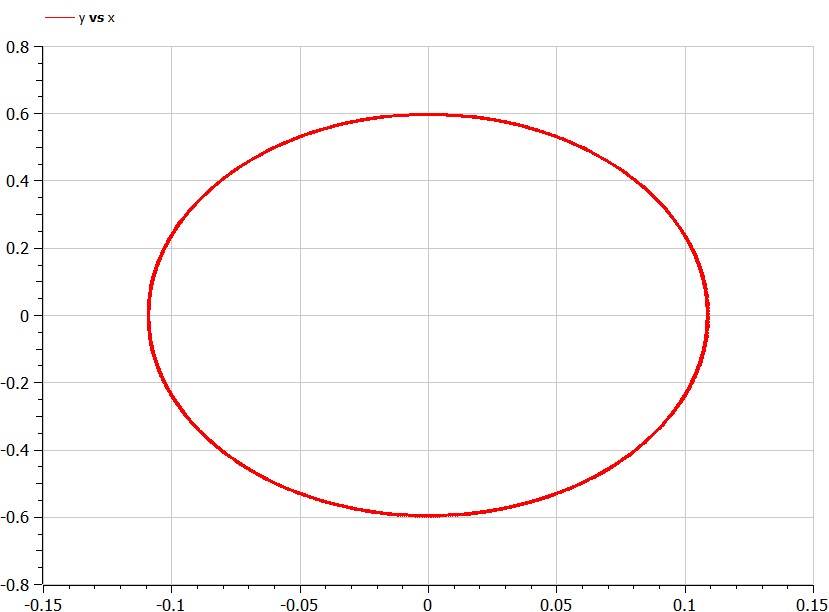
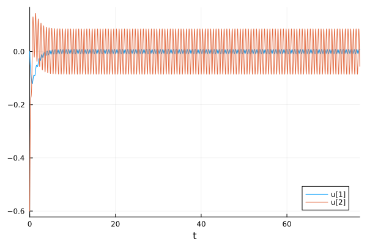
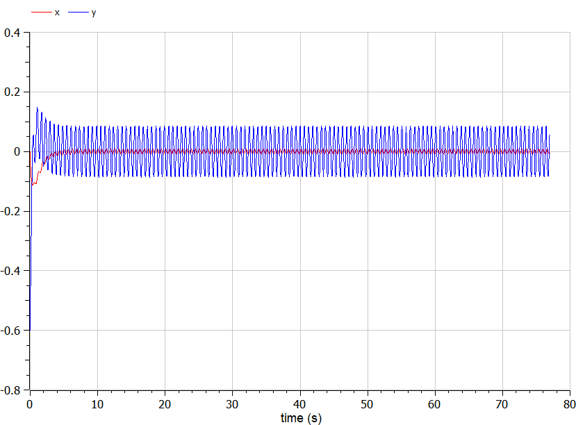
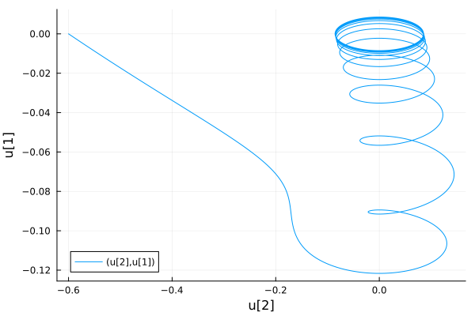
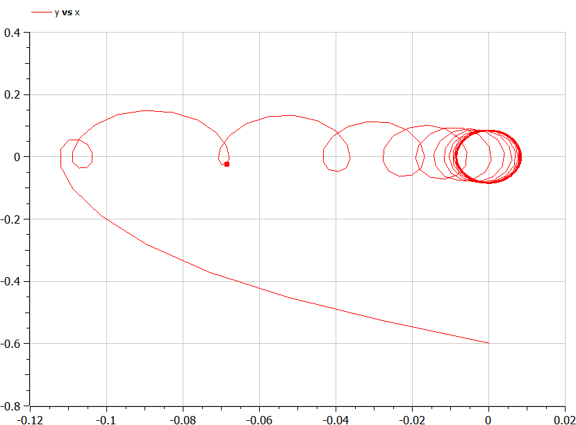

---
## Front matter
lang: ru-RU
title: "Защита лабораторной работы №4

Модель гармонических колебаний"
subtitle: Математическое моделирование
author:
  - Махорин И.С.
institute:
  - Российский университет дружбы народов, Москва, Россия
date: 2024

## i18n babel
babel-lang: russian
babel-otherlangs: english

## Formatting pdf
toc: false
toc-title: Содержание
slide_level: 2
aspectratio: 169
section-titles: true
theme: metropolis
header-includes:
 - \metroset{progressbar=frametitle,sectionpage=progressbar,numbering=fraction}
 - '\makeatletter'
 - '\beamer@ignorenonframefalse'
 - '\makeatother'
---

## Докладчик

:::::::::::::: {.columns align=center}
::: {.column width="70%"}

  * Махорин Иван Сергеевич
  * Студент группы НПИбд-02-21
  * Студ. билет 1032211221
  * Российский университет дружбы народов имени Патриса Лумумбы

:::
::: {.column width="30%"}

:::
::::::::::::::

## Цель лабораторной работы

- Изучить понятие гармонического осциллятора, построить фазовый портрет и найти решение уравнения гармонического осциллятора. 

## Теоретическое введние (1)

- Гармонический осциллятор [1] — система, которая при смещении из положения равновесия испытывает действие возвращающей силы F, пропорциональной смещению x.

{#fig:101 width=50% height=50%}

## Теоретическое введние (2)

- Гармоническое колебание [2] - колебание, в процессе которого величины, характеризующие движение (смещение, скорость, ускорение и др.), изменяются по закону синуса или косинуса (гармоническому закону).

{#fig:102 width=50% height=50%}

## Математическая модель (1)

Движение грузика на пружинке, маятника, заряда в электрическом контуре, а также эволюция во времени многих систем в физике, химии, биологии и других науках при определенных предположениях можно описать одним и тем же дифференциальным уравнением, которое в теории колебаний выступает в качестве основной модели. Эта модель называется линейным гармоническим осциллятором.

## Математическая модель (2)

Уравнение свободных колебаний гармонического осциллятора имеет следующий вид:
$$\ddot{x}+2\gamma\dot{x}+\omega_0^2=0$$

где $x$ - переменная, описывающая состояние системы (смещение грузика, заряд конденсатора и т.д.), $\gamma$ - параметр, характеризующий потери энергии (трение в механической системе, сопротивление в контуре), $\omega_0$ - собственная частота колебаний.
Это уравнение есть линейное однородное дифференциальное  уравнение второго порядка и оно является примером линейной динамической системы.

## Математическая модель (3)

Значение фазовых координат $x, y$ в любой момент времени полностью определяет состояние системы. Решению уравнения движения как функции времени отвечает гладкая кривая в фазовой плоскости. Она называется фазовой траекторией. Если множество различных решений (соответствующих различным 
начальным условиям) изобразить на одной фазовой плоскости, возникает общая картина поведения системы. Такую картину, образованную набором фазовых траекторий, называют фазовым портретом.

## Задание лабораторной работы. Вариант 59

Постройте фазовый портрет гармонического осциллятора и решение уравнения гармонического осциллятора для следующих случаев:

1. Колебания гармонического осциллятора без затуханий и без действий внешней силы $\ddot{x}+30x=0$;

2. Колебания гармонического осциллятора c затуханием и без действий внешней силы $\ddot{x}+10\dot{x}+20x=0$

3. Колебания гармонического осциллятора c затуханием и под действием внешней силы $\ddot{x}+17\dot{x}+3x=0.9cos(10t)$

На интервале $t\in [0;77]$ (шаг $0.05$) с начальными условиями $x_0=0, y_0=-0.6$.

## Задачи:

1. Разобраться в понятии гармонического осциллятора

2. Ознакомиться с уравнением свободных колебаний гармонического осциллятора

3. Построить фазовый портрет гармонического осциллятора и решение уравнения на языках Julia и Open Modelica гармонического осциллятора для следующих случаев:

- Колебания гармонического осциллятора без затуханий и без действий внешней силы

- Колебания гармонического осциллятора c затуханием и без действий внешней силы

- Колебания гармонического осциллятора c затуханием и под действием внешней силы

# Ход выполнения лабораторной работы

## Математическая модель

По представленному выше теоретическому материалу были составлены модели на обоих языках программирования.

# Решение с помощью программ

## Результаты работы кода на Julia и Open Modelica для первого случая (1)

:::::::::::::: {.columns align=center}
::: {.column width="50%"}

{#fig:001}

::: 
::: {.column width="50%"}

{#fig:007 width=90% height=90%}

:::
::::::::::::::

## Результаты работы кода на Julia и Open Modelica для первого случая (2)

:::::::::::::: {.columns align=center}
::: {.column width="50%"}

{#fig:002}

::: 
::: {.column width="50%"}

{#fig:008 width=90% height=90%}

:::
::::::::::::::

## Результаты работы кода на Julia и Open Modelica для второго случая (1)

:::::::::::::: {.columns align=center}
::: {.column width="50%"}

{#fig:003}

::: 
::: {.column width="50%"}

{#fig:009 width=90% height=90%}

:::
::::::::::::::

## Результаты работы кода на Julia и Open Modelica для второго случая (2)

:::::::::::::: {.columns align=center}
::: {.column width="50%"}

{#fig:004}

::: 
::: {.column width="50%"}

{#fig:010 width=90% height=90%}

:::
::::::::::::::

## Результаты работы кода на Julia и Open Modelica для третьего случая (1)

:::::::::::::: {.columns align=center}
::: {.column width="50%"}

{#fig:005}

::: 
::: {.column width="50%"}

{#fig:011 width=80% height=80%}

:::
::::::::::::::

## Результаты работы кода на Julia и Open Modelica для третьего случая (2)

:::::::::::::: {.columns align=center}
::: {.column width="50%"}

{#fig:006}

::: 
::: {.column width="50%"}

{#fig:012 width=80% height=80%}

:::
::::::::::::::

## Анализ полученных результатов

В итоге проделанной работы мы построили по три модели (включающих в себя два графика) на языках Julia и OpenModelica. Построение моделей колебания на языке openModelica занимает меньше строк, чем аналогичное построение на Julia.

# Вывод

## Вывод

В ходе выполнения лабораторной работы были построены решения уравнения гармонического осциллятора и фазовые портреты гармонических колебаний без затухания, с затуханием и при действии внешней силы на языках Julia и Open Modelica.

# Список литературы. Библиография

[1] Документация по Julia: https://docs.julialang.org/en/v1/

[2] Документация по OpenModelica: https://openmodelica.org/

[3] Решение дифференциальных уравнений: https://www.wolframalpha.com/

[4] Бутиков Е. И. Собственные колебания линейного осциллятора. 2011.