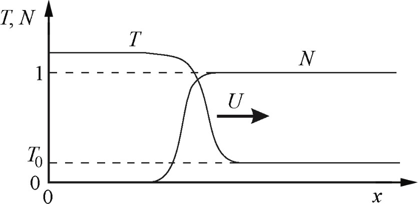
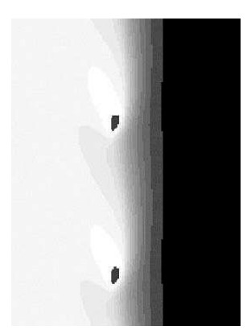

---
## Front matter
lang: ru-RU
title: Теплопроводность, детерминированное горение
subtitle: Этап №1
author:
  - Махорин И. С.
institute:
  - Российский университет дружбы народов, Москва, Россия
date: 24 февраля 2024

## i18n babel
babel-lang: russian
babel-otherlangs: english

## Formatting pdf
toc: false
toc-title: Содержание
slide_level: 2
aspectratio: 169
section-titles: true
theme: metropolis
header-includes:
 - \metroset{progressbar=frametitle,sectionpage=progressbar,numbering=fraction}
 - '\makeatletter'
 - '\beamer@ignorenonframefalse'
 - '\makeatother'
---

# Информация

## Докладчики

:::::::::::::: {.columns align=center}
::: {.column width="70%"}

  * Махорин Иван Сергеевич
  * Шаповалова Диана Дмитриевна
  * Егорова Юлия Владимировна
  * Павлова Варвара Юрьевна
  * Лебединец Татьяна Александровна
  * Великоднева Евгения Владимировна

:::
::: {.column width="40%"}

:::
::::::::::::::

# Вводная часть

## Цели проекта

- Изучить методы математического моделирования на примере теплопроводности и детерминированного горения.

## Задачи проекта

- Исследовать влияние $E$ на режим горения. При каком минимальном значении $E$ возникает пульсирующий режим? 
- Написать программу, решающую одномерное уравнение теплопроводности с адиабатическими граничными условиями, используя явную разностную схему. Исследовать поведение численного решения при различных значениях $χ∆t/h2$.
- Написать программу, решающую одномерное уравнение теплопроводности с адиабатическими граничными условиями, используя неявную разностную схему.

## Определение

- Горение представляет собой феномен природы, являющийся интересным объектом для научного исследования. 
Несмотря на комплексность и разнообразие физико-химических процессов, лежащих в его основе, многие из его характеристик могут быть описаны с использованием простых моделей. 
Для того чтобы произошло горение, необходимы определенные условия, такие как теплопроводность среды и возможность экзотермической реакции, скорость которой зависит от температуры. 
- Детерминированное горение - это процесс горения, который подчиняется определенным законам физики и химии. 
В отличие от случайного горения, его характеристики можно предсказать с высокой точностью. 
Этот тип горения применяется, например, при моделировании работы двигателей внутреннего сгорания.

## Как протекает?

Обычное стационарное горение, при котором скорость распространения зоны активного горения или реакции (фронт пламени) не зависит от времени, 
может стать неустойчивым. Возникают быстрые периоды горения, сменяющиеся пассивными периодами.

В двумерном случае фронт горения может искривляться и состоять из нескольких зон активного горения, 
движущихся вдоль фронта и вглубь материала. Эти зоны могут взаимодействовать, периодически исчезать и появляться снова.

# Основная часть

## Размерная система уравнений
### Закон Аррениуса для реакции первого порядка

Вещество вида $A$ переходит в $B$, при этом выделяется тепло. Для скорости $XP$ воспользуемся законом Аррениуса для реакции первого порядка:

$$ \frac{\partial N}{\partial t} = - \frac{N}{τ} e^{-E/RT}$$ (1.1)

- $N$ — доля непрореагировавшего вещества $A$, меняющаяся от $1$ — исходное состояние, до $0$ — все прореагировало,
- $E$ — энергия активации $XP$
- $τ$ — характерное время перераспределения энергии
- $T$ — температура в данной точке

## Размерная система уравнений
### Одномерный случай

В одномерном случае необходимо добавить уравнение теплопроводности с дополнительным членом, отвечающим за энерговыделение:

$$ ρc \frac{\partial T}{\partial t} = κ \frac{\partial^2 T}{\partial x^2} - ρQ \frac{\partial N}{\partial t}$$ (1.2)

- $ρ$ — плотность
- $c$ — удельная теплоемкость
- $κ$ — коэффициент теплопроводности
- $Q$ — удельное энерговыделение при $XP$

## Размерная система уравнений
### Одномерный случай

{#fig:001 width=50%}

## Система уравнений для безразмерных величин

Поделив уравнение теплопроводности на $ρQ$ и перейдя к безразмерным температуре $\tilde{T} = cT/Q$ и энергии активации $\tilde{E} = cE/(RQ)$ получим систему уравнений:

$$ \frac{\partial T}{\partial t} = χ \frac{\partial^2 T}{\partial x^2} - \frac{\partial N}{\partial t}$$ (2.1)

$$ \frac{\partial N}{\partial t} = - \frac{N}{τ} - e^{-E/T}$$ (2.2)

- $χ = κ/ρc$
- $χ$ - коэффициент температуропроводности

## Различные величины горения
### Одномерный случай

- Первый режим — скорость распространения волны постоянна, а профили температуры и концентрации переносятся вдоль оси $X$ не деформируясь.
- Второй режим — скорость волны переменная, и горение распространяется в виде чередующихся вспышек и угасаний. От значения параметра $E$, зависит какой режим реализуется.

Существует критическое  значение  безразмерной  энергии активации $E \ast$.  При $E < E \ast$ — стационарное горение, а при $E > E \ast$ — пульсирующее. Теоретически можно показать,  что  при $T0 \ll 1$ критическое  значение  $E \ast = 6,56$.  При  увеличении начальной температуры T0 критическое значение $E \ast$ возрастает.

## Различные режимы горения
### Двумерный случай

Для моделирования волны горения в двумерном случае в уравнение:

$$ \frac{\partial T}{\partial t} = χ \frac{\partial^2 T}{\partial x^2} - \frac{\partial N}{\partial t}$$ (2.1)

нужно добавить перенос тепла по второй координате — $χ \frac{\partial^2 T}{\partial y^2}$ 

Кроме стационарного и пульсирующего режимов для этой двухмерной системы возможен третий режим распространения волны горения — спиновый. 

## Различные режимы горения

{#fig:001 width=30%}

## Явная разностная схема 

Рассмотрим численные методы решения одномерного уравнения теплопроводности без химических реакций:

$$ \frac{\partial T}{\partial t} = χ \frac{\partial^2 T}{\partial x^2}$$ (3.1)

Для этого в уравнении теплопроводности заменим частные производные на разностные:

{width=70%} , (3.2)

## Явная разностная схема

Теперь учитываем $ХР$, добавим изменение безразмерной температуры за счёт энерговыделения в химических реакциях за шаг по времени:

{width=70%} , (3.3)

$i = 1, 2, . . . , n$

## Неявные разностные схемы

Неявная схема:

{width=70%} , (3.4)

Неявная схема Кранка-Николсон:

{width=70%} , (3.5)

## Неявные разностные схемы

Преобразовав выражение, получим следующую систему уравнений:

{width=70%} , (3.6)

# Заключительная часть

## Результаты

На данном этапе мы рассмотрели, что такое теплопроводность и детерминированное горение, что
они из себя представляют и что в себе сочетают.
Так же мы познакомились с основными понятиями, которые используются при изучении и построении
уравнений и моделей теплопроводности и детерминированного горения.

## Источники

- Моделирование физических процессов и явлений на ПК / Д. А. Медведев, А. Л. Куперштох, Э. Р. Прууэл [и др.]. – Новосибирск : Новосиб. гос. ун-т, 2010. – 101 с. – ISBN 978-5-94356-933-3.